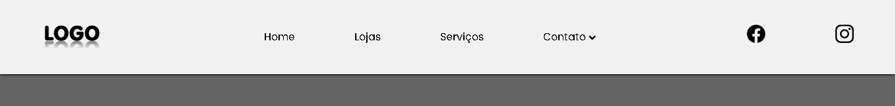
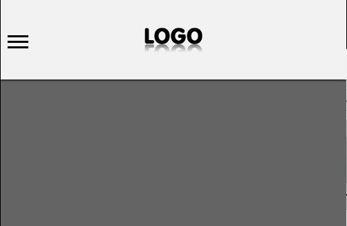

><h2 style="padding:5px;">Exemplos</h2>
<ul>
    <strong> 
    <li>Desktop</li>
    
    <li>Mobile</li>
    
    <strong> 
</ul>

><h2 style="padding:5px">Tecnologias utilizadas</h2>
<ul>
    <strong> 
    <li>HTML</li>
    <li>CSS</li>
    <li>SASS</li>
    <li>JS</li>
    <strong> 
</ul>

